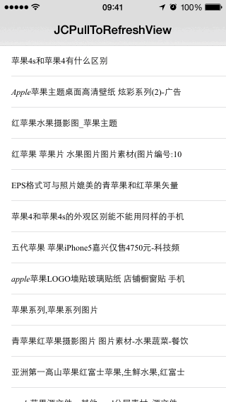

# JCPullToRefreshView

[](https://travis-ci.org/lijingcheng/JCPullToRefreshView)
[](http://cocoapods.org/pods/JCPullToRefreshView)
[](http://cocoapods.org/pods/JCPullToRefreshView)
[](http://cocoapods.org/pods/JCPullToRefreshView)

Supports pull-to-refresh and pull-to-loadmore.

 

## Installation

pod "JCPullToRefreshView"

## Usage

``` objc
#import "UIViewController+JCAdditionsPage.h"
```

Only need to add a line of code in your UIViewController.

``` objc
[self enabledPullToRefreshAndLoadMore:self.collectionView];
```

Refer to demo

## Author

[李京城](http://lijingcheng.github.io)

## License

MIT
